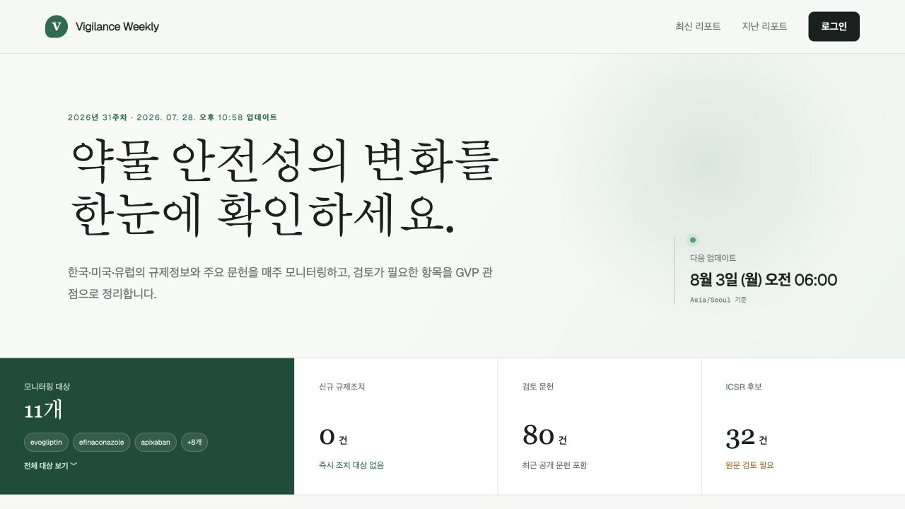
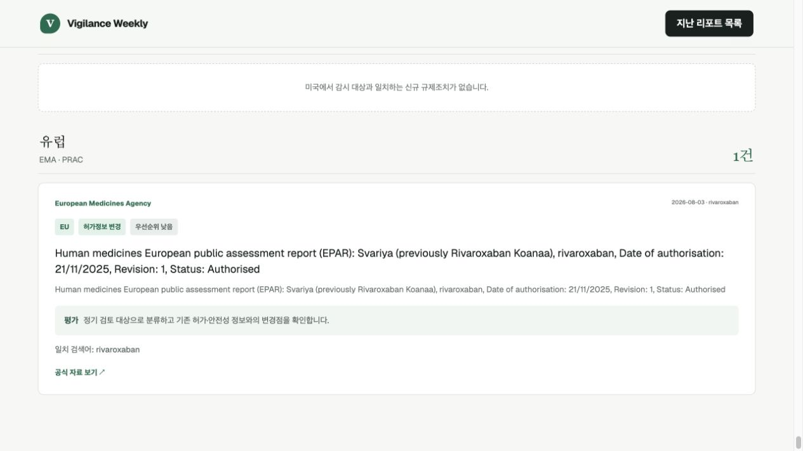
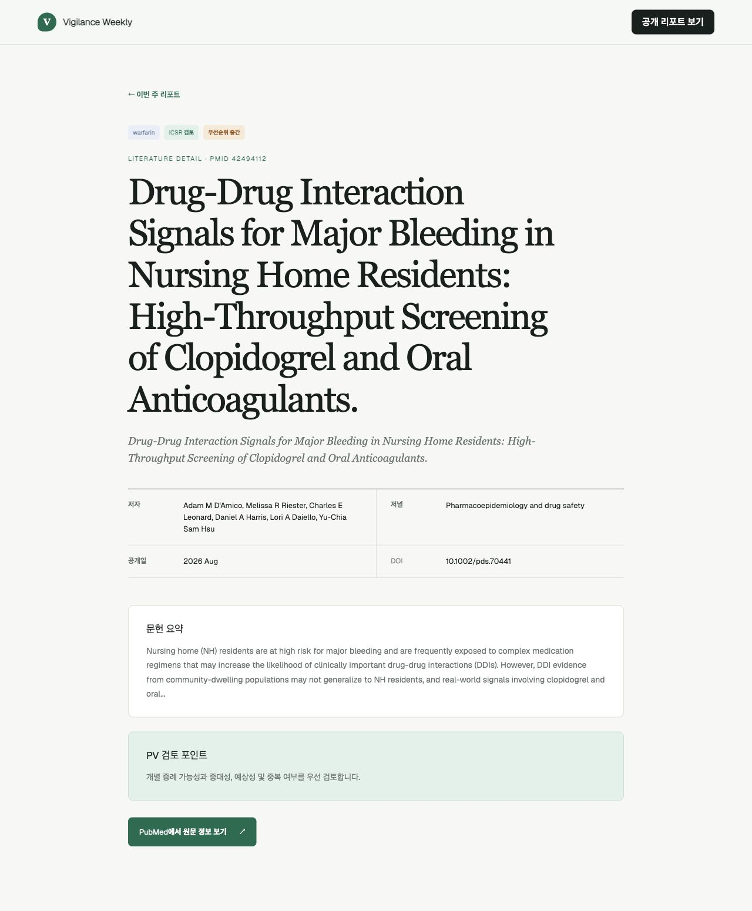

# Vigilance Weekly

Vigilance Weekly는 의약품 관련 문헌과 규제정보를 지속적으로
추적하는 팀 공용 모니터링 서비스입니다. PubMed 문헌과 식약처·KIDS,
FDA, EMA·PRAC의 공개 규제정보를 수집해 매주 한국 시간 기준으로 리포트를
생성하며, 필요할 때 즉시 실행하거나 원하는 날짜와 시각에 일회성 실행을
예약할 수 있습니다.

완성된 리포트는 로그인 없이 열람할 수 있습니다. 로그인한 팀원은 공용
감시 대상 관리, 리포트 생성·예약·취소·삭제 등의 관리 기능을 사용할 수
있습니다.

## 주요 기능

### 최신 리포트 요약

홈 화면은 가장 최근에 완료된 리포트를 자동으로 표시합니다. 감시 대상
수, 신규 규제조치, 검토 문헌 및 ICSR 후보 건수를 한눈에 확인할 수 있고,
지역별 규제정보와 우선순위별 문헌 목록도 이어서 살펴볼 수 있습니다.
지난 리포트는 주차별 보관 목록에서 다시 열람할 수 있습니다.



홈 화면 아래에서는 지역별 규제정보와 실제 검토 문헌을 확인할 수
있습니다. 한국·미국·유럽 카드는 최신 리포트에서 해당 지역의 규제정보
결과로 바로 이동하며, 각 문헌에는 감시 대상, 선별 분류와 우선순위가 함께
표시됩니다.


### 지역별 규제정보 상세 검토

리포트 상세 화면은 규제정보 검색결과를 한국·미국·유럽별로 묶어
표시합니다. 홈과 리포트의 지역 카드는 각 지역 결과 구역에 연결됩니다.
각 검색결과에는 출처 기관과 공개일, 감시 대상, 지역, 조치 유형,
우선순위, 자동 평가, 일치 검색어 및 공식 자료 링크가 함께 표시됩니다.



### 문헌 상세 검토

문헌을 선택하면 감시 대상, 선별 분류, 우선순위, PMID, 저자, 학술지,
공개일, DOI와 초록을 한 화면에서 확인할 수 있습니다. PV 검토 포인트를
참고해 개별 증례 가능성, 중대성, 예상성 및 중복 여부를 검토하고,
PubMed 원문 정보 페이지로 바로 이동할 수 있습니다.



### 감시 대상과 실행 일정 관리

로그인한 팀원은 성분명, 제품명, 검색 별칭과 감시 지역을 공용 감시
대상으로 등록하고 활성 상태를 관리할 수 있습니다. 리포트를 즉시
실행하거나 한국 날짜와 시각을 지정해 예약할 수 있으며, 진행률 확인,
실행 취소와 기존 리포트 삭제도 지원합니다.

## 수집 및 선별 기준

리포트는 실행을 시작할 때 활성화된 공용 감시 대상 목록을 스냅샷으로
저장하고, 각 감시 대상에 대해 PubMed 문헌과 한국·미국·유럽 규제정보를 차례로
수집합니다. 수집 기간은 `Asia/Seoul` 기준 해당 ISO 주차의 월요일부터
일요일까지입니다.

### PubMed 문헌

- 성분명, 제품명 및 쉼표로 구분한 별칭 중 하나가 제목 또는 초록에
  포함된 문헌을 검색합니다.
- 출판일이 해당 리포트의 수집 기간에 포함된 문헌을 최신순으로 최대
  20건 가져옵니다.
- PMID를 기준으로 중복 문헌을 제거합니다.
- PMID, 제목, 저자, 학술지, 출판일, DOI, 초록과 PubMed 원문 페이지
  링크를 보존합니다.
- 제목과 초록에 `case report`, `case series`, `adverse`,
  `angioedema`, `bleed`, `hemorrhage`, `death` 중 하나가 있으면
  `ICSR 검토` 및 `중간` 우선순위로 표시합니다.
- 위 키워드가 없으면 `근거 검토` 및 `낮음` 우선순위로 표시합니다.

### 규제정보

- 감시 지역에 따라 한국은 의약품안전나라 안전성서한과 KIDS 실마리정보,
  미국은 FDA Drug Enforcement, 유럽은 EMA 최신정보의 PRAC·DHPC·EPAR
  관련 공개자료를 검색합니다.
- 등록된 성분명, 제품명 및 쉼표·세미콜론으로 구분한 별칭을 함께
  사용합니다. 다만 FDA API에는 해당 기관 검색 문법이 지원하는 영문·숫자
  검색어만 전달하고, 한국어 제품명과 별칭은 국내 기관 검색에 사용합니다.
- KIDS 공개목록 요청에는 서비스 식별용 User-Agent를 포함해 기관 서버의
  요청 정책에 맞춥니다.
- 기관 공개일 또는 보고일이 해당 리포트의 수집 기간에 포함된 결과만
  보존합니다.
- 동일한 공식 자료가 여러 감시 대상과 일치하면 하나의 규제조치로 합치되,
  일치한 감시 대상과 검색어는 모두 남깁니다.
- 기관, 지역, 제목, 공개일, 설명, 공식 자료 링크와 함께 조치 유형, 자동
  평가 우선순위 및 검토 의견을 보존합니다.
- 조치 유형은 회수, 판매·사용 중지, 허가 취소·철회, 사용 제한·금기,
  허가정보 변경, 안전성 서한, 신호 평가, 공급 제한 및 기타로 분류합니다.
- FDA 회수등급과 기관 원문의 긴급·중지·회수·금기·PRAC 등의 표현을
  이용해 높음·중간·낮음 우선순위를 정합니다. 이 평가는 담당자 검토를
  대체하지 않습니다.

## 선별 기준의 한계

이 서비스의 자동 선별 결과는 안전성 신호나 개별 증례에 대한 최종
의학적·규제적 판단이 아니라, 사람이 후속 검토할 후보를 찾기 위한
보조 자료입니다.

- 키워드 기반 분류는 약물과 이상사례의 인과관계, 중대성 및 ICSR 최소
  요건 충족 여부를 판단하지 않습니다.
- 동일 환자나 증례를 여러 논문에서 다룬 경우 이를 하나의 증례로
  식별하지 않습니다.
- 임상시험, 리뷰, 동물시험 등 연구 유형을 별도로 구분하지 않습니다.
- 각 출처에서 감시 대상별 최대 20건만 수집하므로 검색 결과가 많은
  주에는 일부 항목이 포함되지 않을 수 있습니다.
- KIDS 실마리정보 공개목록은 기관이 공개한 최신 범위 안에서 확인하며,
  새 게시물이 없는 주에는 결과가 생성되지 않습니다.
- EMA의 일반 PRAC 회의 문서처럼 제목과 설명에 감시 대상명이 없는 자료는
  자동으로 약물과 연결하지 않습니다. 감시 대상과 직접 일치하는 공개자료만
  리포트에 포함합니다.
- 출판일과 보고일 등 원문 데이터의 지연·오류 및 외부 API 장애로 인해
  결과가 누락되거나 일부 성공 상태로 완료될 수 있습니다.

## 실행 환경

- Node.js `>=22.13.0`
- pnpm

## 시작하기

```bash
pnpm install
pnpm dev
pnpm build
```

로컬 개발 서버를 시작한 뒤 빌드까지 확인하려면 위 명령을 순서대로
실행합니다. 이 프로젝트의 Cloudflare 바인딩과 크론 설정은
`wrangler.jsonc`가 아니라 `vite.config.ts`에서 관리합니다.

## 주요 구성

- `app/`: 화면, 공개 리포트와 관리 기능의 경로 처리기
- `worker/monitoring.ts`: PubMed와 지역별 규제정보 수집, 리포트 생성 및
  예약 실행
- `worker/index.ts`: Cloudflare Worker 진입점
- `db/schema.ts`: Drizzle ORM으로 정의한 D1 데이터베이스 스키마
- `drizzle/`: 배포 순서대로 보존하는 D1 마이그레이션
- `tests/`: 예약 계산, 실행 상태 및 렌더링 결과 검사
- `vite.config.ts`: 로컬·운영 바인딩과 1분 단위 크론 설정
- `.openai/hosting.json`: 기존 운영 사이트와 D1 바인딩 식별 정보

## 인증과 공개 범위

OpenAI 워크스페이스 사이트는 `oai-authenticated-user-email` 헤더에서
현재 사용자의 이메일 주소를 읽을 수 있습니다.

SIWC로 인증된 사이트는 사용자 프로필에 이름이 있을 때
`oai-authenticated-user-full-name` 헤더도 받을 수 있습니다. 이름은
퍼센트 인코딩된 UTF-8 문자열이며
`oai-authenticated-user-full-name-encoding: percent-encoded-utf-8` 헤더가
함께 전달됩니다.

이름은 선택 정보로 취급하고, 값이 없을 때는 이메일 주소를 대신
사용합니다.

```tsx
import { headers } from "next/headers";

export default async function Home() {
  const requestHeaders = await headers();
  const email = requestHeaders.get("oai-authenticated-user-email");
  const encodedFullName = requestHeaders.get("oai-authenticated-user-full-name");
  const fullName =
    encodedFullName &&
    requestHeaders.get("oai-authenticated-user-full-name-encoding") ===
      "percent-encoded-utf-8"
      ? decodeURIComponent(encodedFullName)
      : null;

  const displayName = fullName ?? email;
  // displayName을 화면에 표시합니다.
}
```

공개 리포트와 지난 리포트는 로그인 없이 열람할 수 있습니다. 감시 대상
관리, 리포트 실행·예약·취소·삭제처럼 데이터를 변경하는 기능은 로그인이
필요합니다. 인증은 관리 기능을 보호하기 위한 것이며, 감시 대상과
리포트를 사용자별로 나누기 위한 것이 아닙니다.

### ChatGPT 로그인 연동

로그인이 필요한 화면에서는 `app/chatgpt-auth.ts`의 도우미를 사용합니다.

- `getChatGPTUser()`: 로그인 여부가 선택적인 화면에서 사용자 정보를
  가져옵니다.
- `requireChatGPTUser(returnTo)`: 비로그인 방문자를 ChatGPT 로그인으로
  보내야 하는 서버 렌더링 화면에서 사용합니다.
- `chatGPTSignInPath(returnTo)`와 `chatGPTSignOutPath(returnTo)`: 로그인과
  로그아웃 링크 또는 동작을 만듭니다.
- `returnTo`에는 로그인 또는 로그아웃 뒤 이동할 동일 출처의 상대 경로를
  전달합니다. 도우미가 경로를 검증하고 안전하게 인코딩합니다.
- 요청별 사용자 헤더에 의존하는 보호 화면에는
  `export const dynamic = "force-dynamic"`을 지정합니다.

`/signin-with-chatgpt`, `/signout-with-chatgpt`, `/callback`, OAuth 쿠키와
인증 헤더 주입은 호스팅 환경에서 관리합니다. 이 예약 경로를 앱에서 직접
구현하지 않습니다. 인증 도우미를 호출하지 않는 경로는 비로그인 방문자가
계속 이용할 수 있습니다.

SIWC는 사용자의 신원만 확인하며 워크스페이스 구성원 자격을 증명하지
않습니다. 워크스페이스 단위 접근 제한이 필요하면 Sites의 접근 정책을
사용하거나 서버에서 명시적인 구성원 목록을 검사해야 합니다.

## 주요 명령

- `pnpm dev`: 로컬 개발 서버를 시작합니다.
- `pnpm lint`: 코드 정적 검사를 실행합니다.
- `pnpm build`: vinext 빌드 결과를 검증합니다.
- `pnpm test`: 앱을 빌드하고 렌더링 결과를 검사합니다.
- `pnpm db:generate`: 데이터베이스 스키마 변경 후 새로운 Drizzle
  마이그레이션을 생성합니다.

## 참고 문서

- [vinext 문서](https://github.com/cloudflare/vinext)
- [Drizzle D1 안내서](https://orm.drizzle.team/docs/get-started/d1-new)
